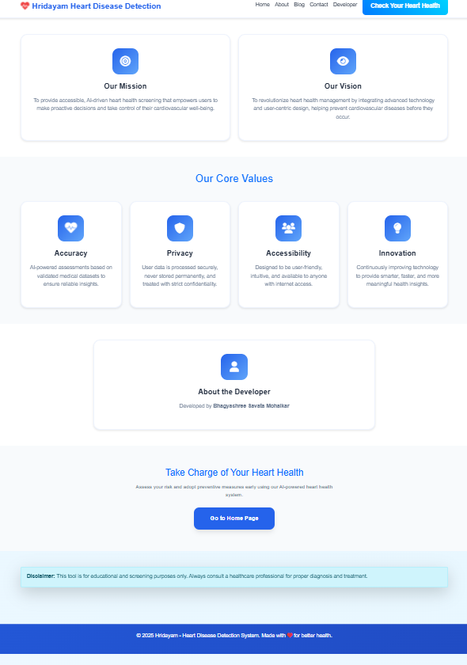

# ❤️ Hridayam — AI-powered Heart Disease Detection 💖

[](LICENSE)  
[]()

## 📑 Table of Contents

- [📘 About the Project](#about-the-project)  
- [✨ Features](#features)  
- [⚙️ How It Works](#how-it-works)  
- [🛠 Tech Stack](#tech-stack)  
- [📥 Setup & Installation](#setup--installation)  
- [▶️ Usage](#usage)  
- [🖼 Screenshots](#screenshots)  
- [📜 License](#license)  
- [👩‍💻 Authors](#authors)

---

## 📘 About the Project

**Hridayam** is a 🌐 web-based **AI-powered system** built to assess the risk of ❤️ heart disease from user-provided health parameters. With the goal of **early detection** and **increased accessibility** to cardiovascular health screening, Hridayam delivers quick, interpretable predictions while prioritizing **user privacy** and **education**.  

🔑 **Key motivations**:  
- 💡 **Preventive care**: Heart disease is one of the leading causes of death globally. Early insights can drive timely medical action.  
- 🌍 **Accessibility**: Enable users anywhere to check risk factors without requiring a clinic visit.  
- 🔍 **Transparent AI**: Provide insight into how the system arrives at predictions and explain influential factors.  
- 🔒 **Privacy-first**: Data is processed securely and not stored permanently, ensuring user confidentiality.  

---

## ✨ Features

- ✔️ Predict risk of heart disease from health inputs (age, blood pressure, cholesterol, etc.)  
- 🖥 Clear, **user-friendly interface**  
- 🔐 **Privacy-focused**: no permanent storage of health data  
- 📊 **Educational insights**: shows potential risk factors and recommendations  
- ⚡ **Fast performance** for quick feedback  

---

## ⚙️ How It Works

1. 📝 **User Input**: Users enter health-related attributes (e.g., age, cholesterol, blood pressure).  
2. 🤖 **Model Inference**: A trained machine learning model processes input and outputs a risk prediction.  
3. 📈 **Risk Interpretation**: The system displays a risk level (low / medium / high) with explanations of contributing factors.  
4. 🩺 **Helpful Resources**: The app provides recommendations (lifestyle, diet, doctor consultation) and educational content about heart health.  

---

## 🛠 Tech Stack

| 🧩 Component       | 🖥 Technology / Library                 |
|-------------------|-----------------------------------------|
| 🔙 Backend         | Python, Flask                          |
| 🎨 Frontend        | HTML, CSS, JavaScript     |
| 🤖 Machine Learning| Scikit-learn, Pandas, NumPy            |

---

## 📥 Setup & Installation

**📌 Prerequisites**  
- 🐍 Python 3.10+   

**⚡ Steps**

```bash
# Clone the repository
git clone https://github.com/your-username/hridayam.git
cd hridayam

# Create virtual environment
python3 -m venv venv
source venv/bin/activate      # On Windows: venv\Scripts\activate

# Install dependencies
pip install -r requirements.txt

# Run the app
flask run
```
## ▶️ Usage

- 🌐 Visit the **Home Page** and navigate to the **Prediction form**.  
- 📝 Fill in your health parameters and submit.  
- 📊 View the **risk result** and interpretation.  
- 📖 Go to the **About** or **Blog / Insights** sections to learn more about heart health.  

---

## 🖼 Screenshots

Here’s a visual walkthrough of **Hridayam**:

- 🏠 **Home Page**  


- 📊 **Prediction Page**  


- ℹ️ **About Page**  


- 📰 **Blog / Insights Page**  


- 📩 **Contact Page**  


- 👩‍💻 **Developer / Team Page**  


---

## 📜 License

📖 This project is licensed under the **MIT License**. See [LICENSE](LICENSE) for more details.  

---

## 👩‍💻 Authors

**Bhagyashree Savata Mohalkar** — ✨ Lead Developer  

💬 *“Health is not valued until sickness comes.”* – Thomas Fuller  

💖 Stay proactive, stay healthy with **Hridayam** 💖

